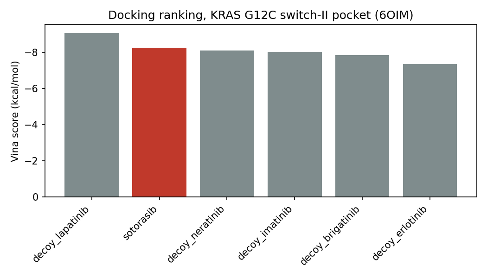

# Group 5 - Drug docking: does Vina recover the KRAS G12C binder?

**Research question:** Does AutoDock Vina rank sotorasib above five property-matched decoys when docked into the KRAS G12C switch-II pocket (PDB 6OIM)?

**Data:** `data/ligands/*.pdbqt` - sotorasib and five decoy kinase inhibitors, already prepared with Meeko. `data/receptor.pdbqt` and `data/box.yaml` are produced once by the instructor with `prepare_receptor.py` (needs internet).

Everything happens in **one file, `analysis.py`**. Each function is a stub that raises
`NotImplementedError`. The file header says who implements what.

| Owner | Functions |
|---|---|
| Student A | `dock_ligand`, `pose_rmsd` |
| Student B | `dock_all`, `plot_ranking` |
| **Both** (this is where the merge conflict happens) | `load_box`, `main`, `summary_sentence` |

Shared parameters live in `config.yaml`. Both students must set the value marked
`# BOTH` — you will disagree, and Git cannot decide for you.

Run with `python analysis.py`. It must run without error after your merge.

**Before class (instructor):** `pip install -r requirements.txt && python prepare_receptor.py` downloads 6OIM
from the RCSB, writes `data/receptor.pdbqt`, `data/crystal_ligand.pdbqt` (sotorasib as bound) and fills `data/box.yaml`.
Docking six ligands at exhaustiveness 4 takes about a minute per ligand on a laptop.

## Results

The merged analysis script ran successfully end to end, but the docking result did not consistently recover sotorasib as the top-ranked ligand; in the recorded run, redocking gave about 3.03 Å heavy-atom RMSD and ranked sotorasib 4th of 6 ligands, behind several decoys.

## Reflection

1. What caused each merge conflict?
   There were two cases, both on Noor's side.
   - **Case 1, `analysis.py` (no textual conflict):** Noor and Giovanni edited different sections of `analysis.py`, so Git could combine the two branches automatically. The only problem was permissions. 
   - **Case 2, the `main` function (line conflict):** Noor and Giovanni both edited the same function, `main`, and Giovanni pushed first. Noor's local `main` and `origin/main` had diverged, so her push was rejected, and Git could not combine the overlapping edits automatically. The conflict had to be resolved by hand before she could push.
2. How could branching strategy or file layout have avoided it?
   Committing directly to `main` is what caused the diverged history and the rejected push. Each of us working on a separate feature branch and merging through pull requests would have avoided it, and would also have handled the permission problem in case 1. Splitting the code into separate modules, with clear ownership of each function, would have avoided the real conflict in case 2, where we both edited `main`. Pulling often keeps local `main` up to date.
3. What is the difference between the history produced by `git pull` and `git pull --rebase`?
   `git pull` fetches the remote changes and merges them into your branch, which adds an extra merge commit and leaves a branching history. `git pull --rebase` fetches them and then replays your local commits on top of the remote ones, so the history stays a single straight line with no merge commit (the replayed commits get new hashes). Noor used `git pull --rebase` after her push was rejected, so her commit sits directly after Giovanni's on `main`.
